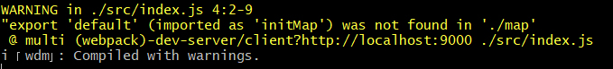

# Решение задания "Найди ошибки"

### Шаг 1
Запускаем проект. Видим ошибку в файле ./src/index.js: initMap не найден в './map'.



В первой строке видим, что не поставлены фигурные скобки. Добавили их и получили следующую строчку: 
 ```javascript
 import { initMap } from "./map";
  ```
Ура! Приложение запустилось!

### Шаг 2
Идём на http://localhost:9000 и видим пустую страницу. В консоли в браузере видим, что скрипт отработал. Смотрим разметку, у блока с картами нет высоты. Смотрим в [документации](https://tech.yandex.ru/maps/doc/jsapi/2.1/quick-start/index-docpage/), там сказано "Создайте видимый контейнер **ненулевого** размера, в котором будет размещена карта". 
Дописываем контейнеру высоту, чтобы он был на весь экран.
Видим карту на весь экран, но нет ни одной метки...

### Шаг 3
Смотрим в src/map.js и в [документацию](https://tech.yandex.ru/maps/doc/jsapi/2.1/quick-start/index-docpage/). Метки создаются, но не добавляются на карту.
Нужно добавить их с помощью конструкции

 ```javascript
 myMap.geoObjects.add(myPlacemark);
 ```

Теперь наши метки появились, но они находятся в Иране, а координаты центра карты прописаны в Москве. В файле src/mappers.js видим, что перепутаны местами широта и долгота, меняем их местами.

### Шаг 4
Видим кластеры, при клике на кластер карта масштабируется, есть исправные и неисправные станции (синие и красные метки соответственно). Фильтр по станциям работает. 
Но не работает условие, что если в кластер входит неисправная станция, то иконка кластера должна показывать, что в нём есть неисправная станция.
В файле src/map.js убираем лишнюю строчку, которая задаёт зеленый цвет кластера по дефолту.

 ```
objectManager.clusters.options.set('preset', 'islands#greenClusterIcons');
 ```
Теперь работает!
 
### Шаг 5
 
Балун открывается, но в нём нет графика. Теперь нам нужно, чтобы заработали графики. Читаем [документацию Chart.js](http://www.chartjs.org/docs/latest/getting-started/). В файле src/chart.js убираем максимум по оси Y и после этого график появляется. 
   
### Шаг 6
  
Приводим код в порядок: выравниваем отступы, выдерживаем общий codestyle и убираем лишний код.